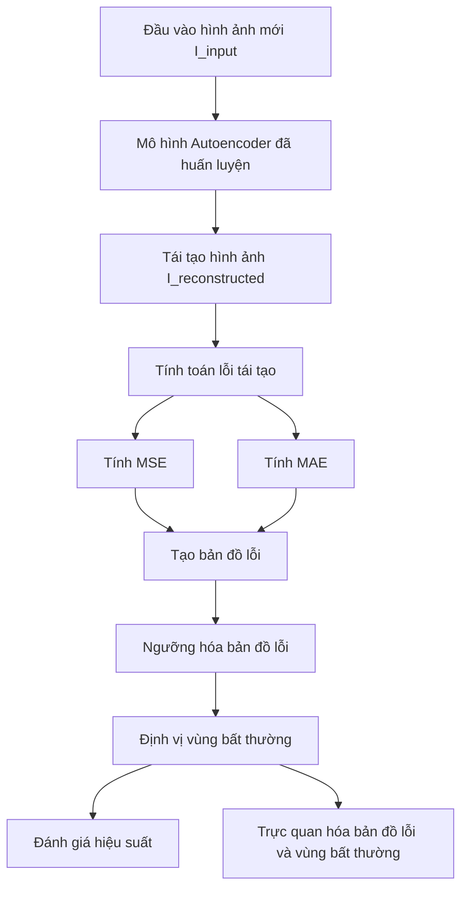

# Tổng quan về ImgAE-Dx

ImgAE-Dx là một dự án nghiên cứu tập trung vào việc phát hiện các bất thường trong ảnh X-quang ngực bằng cách sử dụng các kiến trúc Autoencoder.

Mục tiêu chính là so sánh hiệu quả của hai kiến trúc cụ thể: một kiến trúc U-Net tiêu chuẩn và một kiến trúc Reversed Autoencoder (RA) mới lạ.

## Nguyên lý hoạt động của phát hiện bất thường bằng Autoencoder

Cốt lõi của phương pháp này dựa trên ý tưởng rằng một Autoencoder được huấn luyện *chỉ trên dữ liệu "bình thường" (không có bất thường)* sẽ học được cách biểu diễn và tái tạo lại dữ liệu bình thường một cách hiệu quả.

* Khi một hình ảnh **bình thường** được đưa vào mô hình đã huấn luyện, mô hình sẽ tái tạo lại nó gần như hoàn hảo, dẫn đến **lỗi tái tạo (reconstruction error) thấp**.
* Khi một hình ảnh **bất thường** được đưa vào, mô hình sẽ gặp khó khăn trong việc tái tạo chính xác phần bất thường đó, vì nó chưa bao giờ "thấy" hoặc học cách biểu diễn bất thường. Thay vào đó, nó sẽ cố gắng tái tạo phần bất thường đó thành một dạng "bình thường" mà nó đã học được. Điều này dẫn đến **lỗi tái tạo cao** tại vị trí của bất thường.

Chính sự khác biệt về lỗi tái tạo này là cơ sở để xác định và định vị các bất thường.

## Kiến trúc mô hình (Model Architectures)

ImgAE-Dx nghiên cứu hai kiến trúc Autoencoder chính:

### 1. U-Net (Standard Autoencoder Variant)

* **Kiến trúc:** U-Net là một kiến trúc mạng nơ-ron tích chập (Convolutional Neural Network - CNN) có dạng đối xứng chữ "U", bao gồm một phần mã hóa (encoder) và một phần giải mã (decoder).
  * **Encoder:** Giống như một mạng CNN phân loại thông thường, nó bao gồm các lớp tích chập và pooling để giảm kích thước không gian của hình ảnh và trích xuất các đặc trưng cấp cao.
  * **Decoder:** Đối xứng với encoder, nó sử dụng các lớp tích chập ngược (transposed convolutions) hoặc upsampling để tăng kích thước không gian và tái tạo lại hình ảnh.
  * **Skip Connections (Kết nối bỏ qua):** Đây là đặc điểm nổi bật của U-Net. Các kết nối này truyền trực tiếp thông tin từ các lớp tương ứng trong encoder sang decoder. Điều này giúp decoder giữ lại các chi tiết không gian mịn (fine-grained details) đã bị mất trong quá trình pooling của encoder, rất quan trọng cho việc tái tạo hình ảnh chất lượng cao.
* **Vai trò trong ImgAE-Dx:** U-Net được sử dụng như một Autoencoder mạnh mẽ, có khả năng tái tạo hình ảnh rất tốt. Khi được huấn luyện trên dữ liệu bình thường, nó sẽ học cách tái tạo các cấu trúc giải phẫu bình thường một cách chi tiết. Bất kỳ sai lệch nào so với cấu trúc bình thường (tức là bất thường) sẽ dẫn đến lỗi tái tạo đáng kể.

### 2. Reversed Autoencoder (RA) (Novel Architecture)

* **Kiến trúc:** RA là một biến thể Autoencoder được thiết kế đặc biệt để khuếch đại lỗi tái tạo tại các vị trí bất thường. Dựa trên mô tả, nó có các đặc điểm sau:
  * **Asymmetric Encoder-Decoder (Mã hóa-Giải mã bất đối xứng):** Điều này có thể có nghĩa là số lượng lớp, độ sâu, hoặc dung lượng của encoder và decoder không đối xứng. Mục đích có thể là để encoder nén thông tin mạnh hơn hoặc decoder có khả năng tái tạo hạn chế hơn, buộc mô hình phải học một biểu diễn "bình thường" rất khái quát.
  * **Without Skip Connections (Không có kết nối bỏ qua):** Đây là một điểm khác biệt quan trọng so với U-Net. Việc loại bỏ các skip connections buộc thông tin phải đi qua "nút thắt cổ chai" (bottleneck) của Autoencoder. Điều này làm cho mô hình khó tái tạo lại các chi tiết nhỏ hoặc các cấu trúc phức tạp một cách hoàn hảo, đặc biệt là khi chúng không khớp với biểu diễn "bình thường" đã học.
  * **Specialized "Pseudo-Healthy" Reconstruction Design (Thiết kế tái tạo "giả khỏe mạnh" chuyên biệt):** Đây là nguyên lý cốt lõi của RA cho phát hiện bất thường. Khi mô hình RA được huấn luyện chỉ trên dữ liệu khỏe mạnh, nó sẽ học cách ánh xạ mọi đầu vào (kể cả bất thường) về một biểu diễn không gian tiềm ẩn (latent space) của "sức khỏe". Khi giải mã từ biểu diễn này, nó sẽ cố gắng tái tạo lại hình ảnh như thể nó là một cấu trúc khỏe mạnh. Do đó, nếu có một bất thường trong ảnh đầu vào, RA sẽ không thể tái tạo chính xác bất thường đó mà thay vào đó sẽ tạo ra một phiên bản "giả khỏe mạnh" của vùng đó. Sự khác biệt giữa bất thường thực tế và phiên bản "giả khỏe mạnh" này sẽ tạo ra một lỗi tái tạo rất lớn, làm nổi bật vị trí bất thường.
* **Vai trò trong ImgAE-Dx:** RA được thiết kế để tối đa hóa sự khác biệt giữa hình ảnh bất thường và bản tái tạo của nó, làm cho các bất thường trở nên rõ ràng hơn trên bản đồ lỗi tái tạo so với U-Net.

### Giải thích các Giai đoạn trong Kiến trúc Autoencoder

Để hiểu rõ hơn cách các kiến trúc Autoencoder hoạt động, chúng ta sẽ xem xét các giai đoạn chính mà dữ liệu đi qua:

#### 1. Giai đoạn Đầu vào (Input Layer)

* **Mục đích:** Đây là điểm khởi đầu của mạng, nơi hình ảnh thô được đưa vào mô hình.
* **Hoạt động:** Hình ảnh đầu vào (ví dụ: ảnh X-quang `1x256x256`) được chuẩn hóa (ví dụ: giá trị pixel từ 0-255 về 0-1) và đưa vào lớp đầu tiên của mạng.
* **Ý nghĩa:** Đảm bảo dữ liệu được định dạng phù hợp để các lớp tiếp theo xử lý.

#### 2. Giai đoạn Mã hóa (Encoder)

* **Mục đích:** "Nén" thông tin từ hình ảnh đầu vào thành một biểu diễn nhỏ gọn hơn, có ý nghĩa hơn trong không gian tiềm ẩn (latent space). Giai đoạn này học cách trích xuất các đặc trưng quan trọng từ hình ảnh.
* **Hoạt động:**
  * Bao gồm một chuỗi các khối (block) lặp lại, mỗi khối thường chứa các lớp tích chập (Convolutional Layers) và hàm kích hoạt (ReLU).
  * Các lớp tích chập giúp phát hiện các mẫu (patterns) và đặc trưng cục bộ (local features) trong hình ảnh (ví dụ: cạnh, góc, kết cấu).
  * Sau mỗi vài lớp tích chập, thường có một lớp pooling (ví dụ: Max Pooling) để giảm kích thước không gian của bản đồ đặc trưng (feature map), đồng thời tăng số lượng kênh (filter) để nắm bắt các đặc trưng phức tạp hơn.
* **Ý nghĩa:** Giai đoạn này giống như việc tóm tắt một cuốn sách dài thành một vài trang ghi chú quan trọng. Nó loại bỏ thông tin dư thừa và giữ lại những gì cần thiết để hiểu nội dung chính của hình ảnh. Đối với phát hiện bất thường, encoder học cách mã hóa các đặc trưng của hình ảnh "bình thường".

#### 3. Giai đoạn Nút thắt cổ chai (Bottleneck)

* **Mục đích:** Đây là điểm hẹp nhất trong kiến trúc Autoencoder, nơi biểu diễn của hình ảnh bị nén tối đa. Nó buộc mô hình phải học biểu diễn cô đọng và hiệu quả nhất của dữ liệu đầu vào.
* **Hoạt động:** Thường là một hoặc vài lớp tích chập cuối cùng của encoder, nơi kích thước không gian của bản đồ đặc trưng là nhỏ nhất (ví dụ: `16x16` hoặc `8x8`) nhưng số lượng kênh (filter) là lớn nhất (ví dụ: `1024` hoặc `2048`).
* **Ý nghĩa:** Đây là "trái tim" của Autoencoder. Mọi thông tin cần thiết để tái tạo lại hình ảnh phải được chứa trong biểu diễn tại nút thắt này. Đối với phát hiện bất thường, nút thắt cổ chai chứa biểu diễn "tinh túy" của dữ liệu bình thường. Nếu một hình ảnh bất thường được đưa vào, biểu diễn của nó tại nút thắt sẽ bị "ép" vào không gian của dữ liệu bình thường, dẫn đến khó khăn trong việc tái tạo chính xác phần bất thường.

#### 4. Giai đoạn Giải mã (Decoder)

* **Mục đích:** "Giải nén" biểu diễn đã được mã hóa từ nút thắt cổ chai để tái tạo lại hình ảnh đầu vào ban đầu.
* **Hoạt động:**
  * Bao gồm một chuỗi các khối lặp lại, sử dụng các lớp tích chập ngược (Transposed Convolutional Layers) hoặc upsampling để tăng kích thước không gian của bản đồ đặc trưng.
  * Các lớp tích chập tiếp tục tinh chỉnh các đặc trưng và xây dựng lại hình ảnh.
* **Ý nghĩa:** Giai đoạn này giống như việc mở rộng các ghi chú quan trọng trở lại thành một cuốn sách đầy đủ. Nó cố gắng tái tạo lại hình ảnh gốc một cách chính xác nhất có thể.

##### Sự khác biệt quan trọng giữa U-Net và RA ở giai đoạn Decoder

* **U-Net:** Sử dụng **Skip Connections (Kết nối bỏ qua)**. Các kết nối này truyền trực tiếp các đặc trưng từ các lớp tương ứng trong encoder sang decoder. Điều này giúp decoder có quyền truy cập vào các chi tiết không gian mịn đã bị mất trong quá trình pooling của encoder, giúp tái tạo hình ảnh đầu ra rất chi tiết và sắc nét.
* **Reversed Autoencoder (RA):** **Không có Skip Connections**. Việc thiếu các kết nối này buộc decoder phải tái tạo hình ảnh *chỉ dựa vào thông tin đã được nén qua nút thắt cổ chai*. Điều này làm cho RA kém khả năng tái tạo các chi tiết nhỏ hoặc các bất thường mà nó chưa từng thấy trong quá trình huấn luyện. Khi gặp bất thường, nó sẽ tái tạo vùng đó thành một dạng "giả khỏe mạnh" dựa trên những gì nó đã học về dữ liệu bình thường, dẫn đến lỗi tái tạo lớn hơn nhiều so với U-Net tại vị trí bất thường.

#### 5. Giai đoạn Đầu ra (Output Layer)

* **Mục đích:** Tạo ra hình ảnh tái tạo cuối cùng với định dạng và phạm vi giá trị mong muốn.
* **Hoạt động:** Thường là một lớp tích chập cuối cùng (ví dụ: `1x1` kernel) để điều chỉnh số lượng kênh về số kênh của ảnh đầu vào (ví dụ: 1 kênh cho ảnh grayscale). Sau đó là một hàm kích hoạt (ví dụ: Sigmoid) để đảm bảo giá trị pixel nằm trong một phạm vi cụ thể (ví dụ: 0-1).
* **Ý nghĩa:** Đây là hình ảnh mà mô hình đã tái tạo được, sẽ được so sánh với hình ảnh đầu vào để tính toán lỗi tái tạo.

Tóm lại, các giai đoạn này làm việc cùng nhau để Autoencoder học được một biểu diễn hiệu quả của dữ liệu bình thường, và từ đó, phát hiện ra những "điều bất thường" bằng cách đo lường mức độ khó khăn của nó trong việc tái tạo chúng.

## Thuật toán phát hiện bất thường (Anomaly Detection Algorithm)

Sau khi các mô hình U-Net và RA đã được huấn luyện thành công trên tập dữ liệu hình ảnh bình thường, thuật toán phát hiện bất thường cho một hình ảnh mới sẽ diễn ra như sau:

1. **Đầu vào hình ảnh:** Một hình ảnh y khoa mới ($I_{input}$) được đưa vào mô hình Autoencoder đã huấn luyện (U-Net hoặc RA).
2. **Tái tạo hình ảnh:** Mô hình Autoencoder tạo ra một hình ảnh tái tạo ($I_{reconstructed}$).
3. **Tính toán lỗi tái tạo:** Lỗi tái tạo được tính toán bằng cách so sánh từng pixel (hoặc từng vùng) giữa $I_{input}$ và $I_{reconstructed}$. Các độ đo phổ biến bao gồm:
    * **Mean Squared Error (MSE):** $MSE = \frac{1}{N} \sum_{i=1}^{N} (I_{input,i} - I_{reconstructed,i})^2$
    * **Mean Absolute Error (MAE):** $MAE = \frac{1}{N} \sum_{i=1}^{N} |I_{input,i} - I_{reconstructed,i}|$
    * Kết quả là một bản đồ lỗi (error map) có cùng kích thước với hình ảnh đầu vào, trong đó mỗi pixel/vùng thể hiện mức độ lỗi tái tạo tại vị trí đó.
4. **Ngưỡng hóa và định vị bất thường:**
    * Áp dụng một ngưỡng (threshold) lên bản đồ lỗi. Các pixel/vùng có giá trị lỗi vượt quá ngưỡng được coi là bất thường. Ngưỡng này thường được xác định dựa trên phân phối lỗi tái tạo của tập dữ liệu bình thường (ví dụ: sử dụng phân vị thứ 95 hoặc 99 của lỗi trên tập validation bình thường).
    * Các vùng bất thường được khoanh vùng (ví dụ: bằng bounding box hoặc segmentation mask) để định vị chính xác vị trí của chúng trên hình ảnh gốc.
5. **Đánh giá và trực quan hóa:**
    * Đánh giá hiệu suất phát hiện bất thường bằng các độ đo như AUC-ROC.
    * Trực quan hóa bản đồ lỗi và các vùng bất thường được khoanh vùng để bác sĩ có thể dễ dàng nhận diện.

## Điểm đặc biệt của ImgAE-Dx

Dự án ImgAE-Dx không chỉ triển khai một Autoencoder mà còn thực hiện một **nghiên cứu so sánh nghiêm ngặt** giữa U-Net và Reversed Autoencoder. Điều này cho phép đánh giá khách quan ưu nhược điểm của từng kiến trúc trong bối cảnh phát hiện bất thường không giám sát, đặc biệt là khả năng của RA trong việc khuếch đại tín hiệu bất thường thông qua cơ chế tái tạo "giả khỏe mạnh" và thiếu skip connections.
